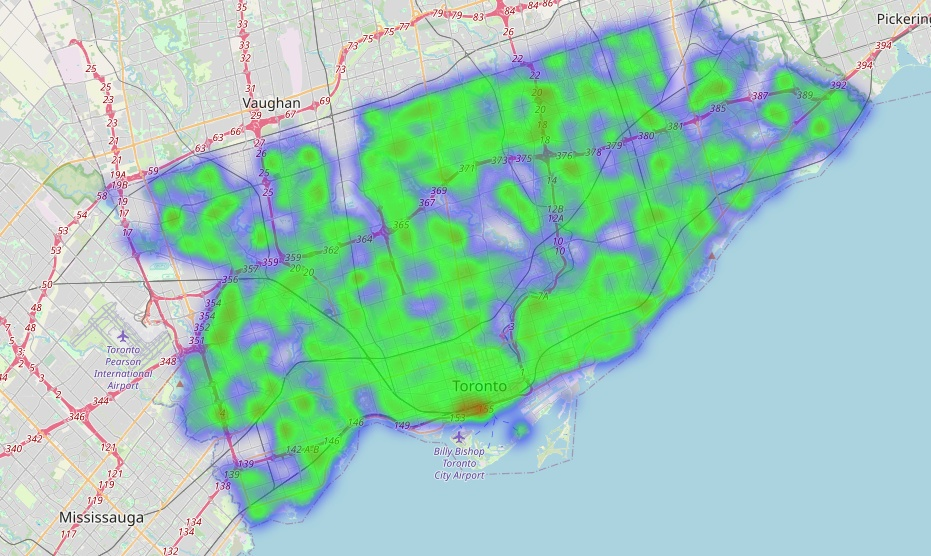
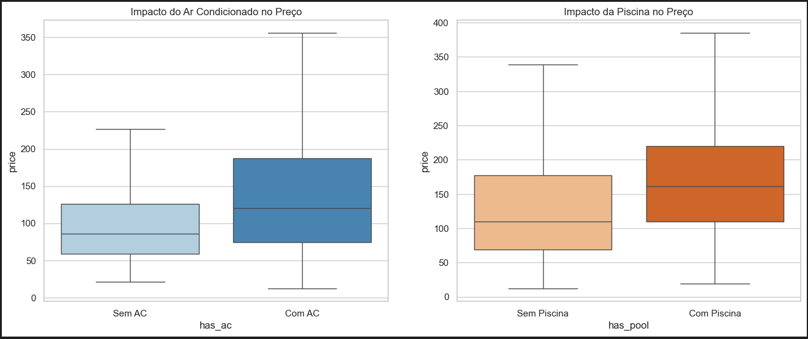

# 🏡 Airbnb Data Pipeline & Investment Strategy


> **Uma aplicação de inteligência de mercado que processa dados do Airbnb para identificar micro-mercados imobiliários subvalorizados.**

---

## 💼 Visão Geral do Negócio

O objetivo deste projeto é simular uma consultoria de investimentos "Data-Driven". Em vez de apenas visualizar preços, o sistema responde à pergunta estratégica: **"Onde investir capital para obter o maior retorno (ROI) com o menor risco em aluguéis de curta temporada?"**

Utilizando dados públicos do _Inside Airbnb_, construí um pipeline que ingere, sanitiza e enriquece os dados brutos, culminando em um dashboard interativo que recomenda ativos específicos baseados em eficiência de capital.

---

```markdown
## 📂 Estrutura do Projeto

projeto-airbnb/
├── data/
│ ├── raw/ # Dados brutos (GitIgnored)
│ └── processed/ # Dados Parquet otimizados (GitIgnored)
├── notebooks/ # Jupyter Notebooks para prototipagem
├── src/ # Código Fonte do Pipeline
│ ├── ingestion.py # Ingestão de Dados
│ ├── cleaning.py # Limpeza e Tratamento de Outliers
│ ├── features.py # Engenharia de Atributos
│ └── app.py # Aplicação Streamlit
├── assets/ # Imagens e Prints
├── requirements.txt # Dependências do Projeto
└── README.md # Documentação
```

---

## ⚙️ Arquitetura e Engenharia de Dados

O projeto segue princípios de Engenharia de Software, segregando responsabilidades em módulos ETL.

### 1. Pipeline de ETL (`src/`)

- **Ingestion (`ingestion.py`):** Carregamento otimizado de arquivos comprimidos (`.csv.gz`), garantindo eficiência de memória.
- **Cleaning & Quality (`cleaning.py`):**
  - Tratamento de tipos de dados (casting de preços e datas).
  - **Remoção Estatística de Outliers:** Aplicação do método IQR (Intervalo Interquartil) para eliminar distorções de preços (ex: erros de cadastro ou imóveis de ultra-luxo que enviesam a média).
  - Persistência em formato **Parquet** (Snappy compression) para tipagem forte e alta performance de leitura.
- **Feature Engineering (`features.py`):**
  - **Receita Estimada (San Francisco Model):** Cálculo de métricas sintéticas (`Reviews/Mês * Estadia Mínima * Preço`) para projetar o faturamento mensal.
  - **Engenharia de Amenities:** Parsing de listas não estruturadas para isolar variáveis de valor (Piscina, Ar Condicionado, Workspace).

### 2. Frontend Analítico (`src/app.py`)

Aplicação desenvolvida em **Streamlit** que consome os dados processados (Parquet) e oferece:

- Filtros dinâmicos de orçamento e risco (número de reviews).
- **Matriz de Oportunidade (Scatter Plot):** Quadrantes estratégicos para identificar bairros de "Baixo Custo / Alto Retorno".
- Mapas de calor geoespaciais (Folium).

---

## 📊 Principais Insights (Consultoria)

A análise automatizada gerou a seguinte tese de investimento para o mercado analisado:

1.  **Alvo de Investimento:** O micro-mercado **Waterfront Communities - The Island** foi identificado como a melhor oportunidade.
    - **Eficiência:** Custo de entrada inferior à média da cidade.
    - **Performance:** Receita estimada apenas marginalmente inferior ao topo do mercado de luxo.
2.  **Engenharia de Valor (Amenities):**
    - ❄️ **Ar Condicionado:** Imóveis com AC comandam um prêmio de **+28.9%** na diária.
    - 🏊 **Piscina:** Adiciona **+16.0%** ao valor percebido.
    - _Insight:_ O conforto térmico é mais valorizado pelo hóspede do que o lazer da piscina neste mercado.

---

## 📸 Screenshots





---

## 🛠️ Como Executar o Projeto

Pré-requisitos: Python 3.10+ e Git.

```bash
# 1. Clone o repositório
git clone [https://github.com/SEU-USUARIO/projeto-airbnb.git](https://github.com/SEU-USUARIO/projeto-airbnb.git)
cd projeto-airbnb

# 2. Crie e ative o ambiente virtual
python -m venv .venv
# Windows:
.\.venv\Scripts\activate
# Linux/Mac:
source .venv/bin/activate

# 3. Instale as dependências
pip install -r requirements.txt

# 4. Execute o Pipeline ETL (Ordem Importante)
python src/ingestion.py   # Valida dados brutos
python src/cleaning.py    # Limpa e cria .parquet
python src/features.py    # Cria métricas de negócio

# 5. Inicie o Dashboard
streamlit run src/app.py
```

```

```
